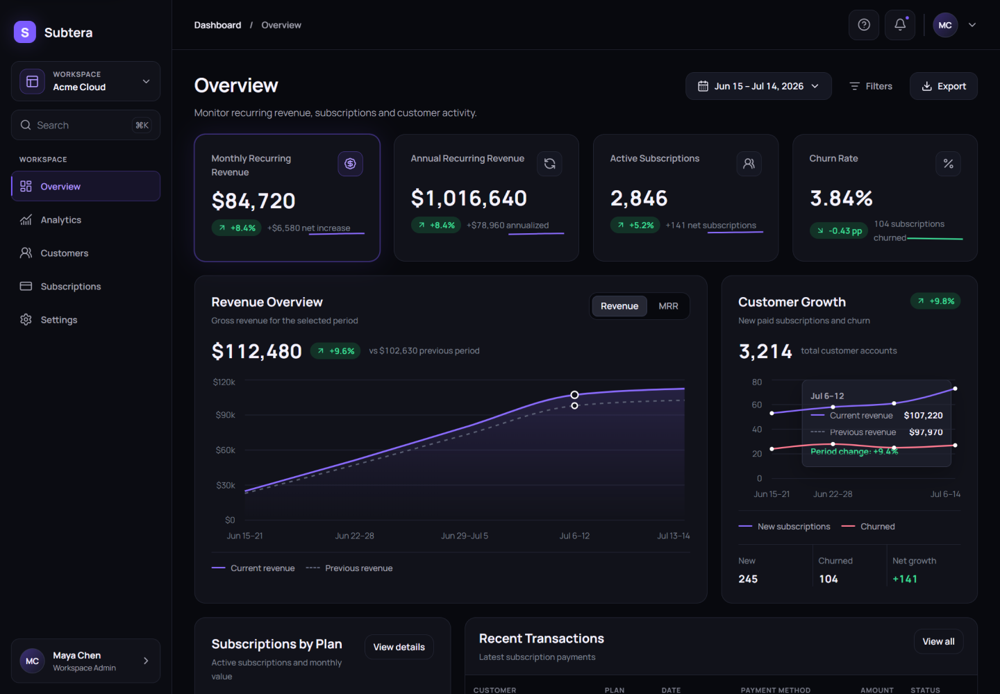
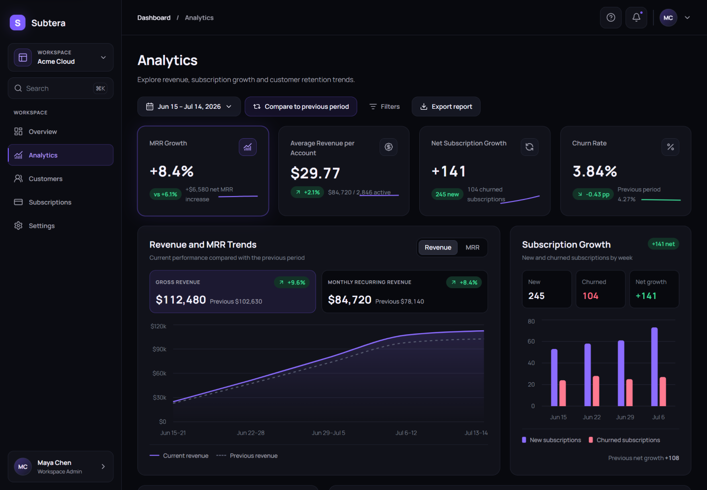
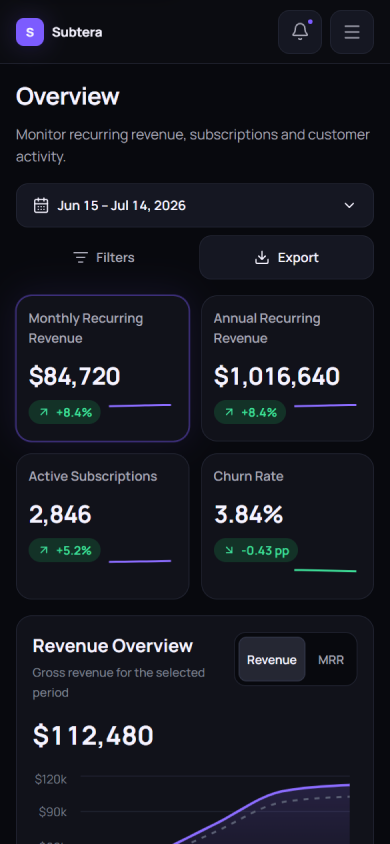

# figma-to-nextjs-saas-dashboard

A production-style Figma-to-Next.js portfolio implementation for **Subtera**, a fictional B2B subscription analytics SaaS dashboard.

The project demonstrates a complete UI/UX-to-frontend workflow for the Upwork Project Catalog service:

> You will get a Figma to React or Next.js responsive frontend.

## Live demo

[Open the Subtera dashboard](https://andress84.github.io/figma-to-nextjs-saas-dashboard/)

## Screenshots

### Overview dashboard

[](https://andress84.github.io/figma-to-nextjs-saas-dashboard/)

### Analytics and responsive mobile layout

<table>
  <tr>
    <td width="67%" valign="top">
      
    </td>
    <td width="33%" valign="top">
      
    </td>
  </tr>
  <tr>
    <td align="center"><strong>Analytics — desktop</strong></td>
    <td align="center"><strong>Overview — mobile</strong></td>
  </tr>
</table>

## Project status

- **Technical foundation:** complete
- **UI/UX handoff:** complete
- **Five dashboard routes:** implemented
- **Responsive integration:** complete
- **Accessibility and automated QA:** complete
- **GitHub Pages deployment:** active

The repository contains the approved design handoff, reusable Next.js implementation, deterministic demo data, automated tests, continuous integration, and automatic GitHub Pages deployment.

## Highlights

- Responsive SaaS application shell with desktop sidebar and mobile navigation drawer
- Five fully implemented product routes
- Shared reporting-period calendar popover
- Reusable dashboard cards, charts, tables, filters, tabs, forms, toggles, badges, and dialogs
- Searchable, sortable, filterable, and paginated data tables
- Deterministic CSV and JSON demo exports
- Local-only demo actions with clear non-persistent feedback
- Typed centralized mock data shared across routes
- Accessible keyboard interactions, focus containment, focus restoration, and reduced-motion support
- Initial-load application preloader with progress indication and animated reveal
- Static export configured for GitHub Pages
- Automated formatting, linting, type checking, unit tests, browser tests, and production builds

## Product routes

| Route | Product page | Main features |
| --- | --- | --- |
| `/` | Overview | Revenue metrics, customer growth, plan distribution, transactions |
| `/analytics` | Analytics | Revenue reporting, MRR view, comparison controls, plan performance |
| `/customers` | Customers | KPI summary, lifecycle tabs, search, filters, sortable customer table |
| `/subscriptions` | Subscriptions | Subscription KPIs, plan performance, status chart, subscription directory |
| `/settings` | Settings | Workspace profile, reporting defaults, regional preferences, notifications, privacy |

All routes share one responsive application shell and a consistent component, token, and data system.

## My role

I designed and implemented this portfolio project from end to end.

My responsibilities included:

- defining the fictional SaaS product concept and dashboard scope
- creating the original desktop and mobile UI/UX design
- planning the information architecture and responsive behavior
- preparing the component system, design tokens, interaction states, and implementation handoff
- converting the approved interface into reusable Next.js and React components
- implementing charts, data tables, filters, forms, dialogs, navigation, and responsive layouts
- creating deterministic fictional product and subscription data
- implementing keyboard accessibility, focus management, reduced-motion support, and mobile touch targets
- writing unit, component, accessibility, and cross-browser end-to-end tests
- configuring continuous integration and automatic GitHub Pages deployment

The project demonstrates both my UI/UX design process and my frontend implementation skills.

## Technology stack

- Next.js 16.2 with the App Router
- React 19
- TypeScript in strict mode
- React Server Components by default
- Tailwind CSS 4
- CSS custom properties for design tokens
- Recharts
- Lucide React
- pnpm 11 through Corepack
- Node.js 24
- Biome
- ESLint
- Vitest
- React Testing Library
- Playwright
- Axe accessibility checks
- GitHub Actions
- GitHub Pages

## Architecture

The implementation uses Server Components by default and introduces focused client boundaries only where interaction is required.

Shared concerns are kept in reusable modules:

- application shell and navigation
- dashboard presentation components
- chart primitives
- data-table primitives
- shared UI controls
- typed mock data
- formatting and export utilities
- route-specific feature modules

The project intentionally avoids duplicating route-specific versions of shared components.

## Project structure

```text
.
├── .github/
│   └── workflows/
│       ├── ci.yml
│       └── deploy-pages.yml
├── design/
│   ├── approved-screens/
│   ├── brief/
│   ├── handoff/
│   ├── presentation/
│   ├── prototype-source/
│   └── references/
├── docs/
├── e2e/
├── public/
├── src/
│   ├── app/
│   ├── components/
│   │   ├── charts/
│   │   ├── dashboard/
│   │   ├── data-table/
│   │   ├── layout/
│   │   └── ui/
│   ├── data/
│   │   └── mock/
│   ├── features/
│   ├── lib/
│   ├── test/
│   └── types/
├── next.config.ts
├── playwright.config.ts
├── vitest.config.ts
└── package.json
```

## Design handoff

The `design/` directory contains the approved UI/UX source material used for implementation.

Implementation priority:

1. `design/approved-screens/`
2. `design/brief/final-approved-specification.md`
3. `design/brief/implementation-scope.md`
4. `design/handoff/`
5. `design/prototype-source/`
6. `design/references/`

Approved screenshots are the visual source of truth. The static prototype is retained as a visual and content reference, not as the production architecture.

## Installation

Use Node.js 24 and the pnpm version declared in `package.json`.

```bash
corepack enable
pnpm install --frozen-lockfile
```

No project tool needs to be installed globally.

## Development

```bash
pnpm dev
```

Open [http://localhost:3000](http://localhost:3000).

Other useful commands:

```bash
pnpm build
pnpm start
```

## Quality checks

```bash
pnpm format
pnpm format:check
pnpm lint
pnpm lint:fix
pnpm typecheck
pnpm test
pnpm test:watch
pnpm test:e2e
pnpm test:e2e:ui
pnpm check
pnpm check:full
```

`pnpm check` runs formatting validation, ESLint, strict TypeScript checking, unit and component tests, and a production build.

`pnpm check:full` runs the complete standard quality suite followed by Playwright tests across Chromium, Firefox, and WebKit.

## GitHub Pages deployment

The project is exported as a static Next.js site and deployed automatically through `.github/workflows/deploy-pages.yml`.

Every push to `main` triggers:

1. dependency installation;
2. static production build;
3. artifact upload;
4. deployment to GitHub Pages.

Live URL:

[https://andress84.github.io/figma-to-nextjs-saas-dashboard/](https://andress84.github.io/figma-to-nextjs-saas-dashboard/)

To create the same static export locally in PowerShell:

```powershell
$env:GITHUB_PAGES = "true"
pnpm build
Remove-Item Env:GITHUB_PAGES
```

The generated site is written to `out/`.

## Accessibility

The dashboard includes:

- semantic headings, regions, tables, labels, and status text
- keyboard-operable controls
- visible focus states
- dialog and drawer focus containment
- Escape-key dismissal
- trigger-focus restoration
- accessible chart summaries
- minimum mobile touch-target sizing
- reduced-motion support
- automated accessibility smoke tests

## License

The application source code is available under the [MIT License](LICENSE).

The original Subtera UI/UX design, approved design screens, screenshots, presentation assets, visual references, and other materials stored under `design/` and `docs/screenshots/` are not covered by the MIT License.

Those visual materials remain copyright © 2026 Andrii Kurus (LaimAnd). See [`design/LICENSE.md`](design/LICENSE.md) for details.

## Demo limitations

This is a frontend portfolio demonstration, not a live SaaS product.

The project intentionally does not include:

- authentication
- a database
- backend services
- Stripe or real billing
- persistent account changes
- production customer data

All companies, customers, subscriptions, transactions, analytics, financial values, and account details are fictional.

## Purpose

This repository demonstrates a professional, accessible, responsive Figma-to-Next.js implementation workflow with reusable components, structured data, automated QA, and continuous deployment.
